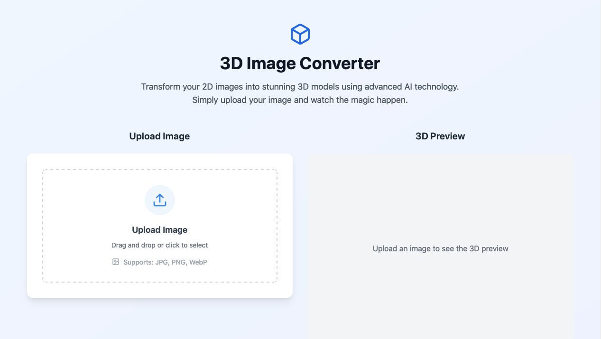

# 3D Image Converter

A web-based application that converts 2D images into 3D voxel-based models using a Variational autoencoders (VAEs). This project includes a React-based frontend and a Flask backend integrated with a PyTorch-powered VAE model and we use pix3d [dataset](http://pix3d.csail.mit.edu/data/pix3d.zip)


## Table of Contents

- [Introduction](#introduction)
- [Features](#features)
- [Project Structure](#project-structure)
- [Installation](#installation)
  - [Frontend Setup](#frontend-setup)
  - [Backend Setup](#backend-setup)
- [Usage](#usage)
- [Dependencies](#dependencies)
- [Build and Deployment](#deployment)
- [License](#license)

---

## Introduction

The **3D Image Converter** enables users to upload 2D images, which are processed through a pre-trained VAE model to generate 3D models represented as voxels. The frontend provides an intuitive user interface, while the backend handles 3D model generation and API requests.

### Web Interface



## Features

- Upload a 2D image to generate a 3D voxel model.
- Interactive visualization of the generated 3D model.
- API for real-time image-to-3D conversion.
- Modular design with React for the frontend and Flask with PyTorch for the backend.

## Project Structure

```bash
R3D2D
│
├── Frontend/                     # React-based frontend
│   ├── src/                      # Source code for UI components
│   ├── public/                   # Static assets like images and index.html
│   ├── node_modules/             # Node.js dependencies (generated after npm install)
│   ├── package.json              # Configuration for frontend dependencies and scripts
│   ├── vite.config.js            # Vite configuration for React
│   └── README.md                 # Frontend-specific documentation (if any)
│
├── Backend/                      # Flask backend with GAN integration
│   ├── app.py                    # Main backend application
│   ├── classVAE.py               # GAN model functions and utilities
│   ├── VAE/                      # VAE architecture definitions
│   │   ├── vae_model.pth          # VAE Generator model for 3D reconstruction
│   │   └── utils.py              # Utility functions for model loading and preprocessing
│   ├── static/                   # Folder for React build files (after deployment)
│   ├── requirements.txt          # List of Python dependencies
│   └── README.md                 # Backend-specific documentation (if any)
│
├── Notebooks/                    # Jupyter notebooks for experiments and analysis
│   ├── VAEdfinal.ipynb           # main notebook
│   └── test_vae.ipynb            # test notebook 
│
├── README.md                     # Project documentation (this file)
└── requirements.txt              # Global project dependencies for Python

```


## Installation


   


### Run Locally

### Frontend Setup

Clone the project

```bash
  git clone https://link-to-project
```

Go to the project directory

```bash
  cd my-project
```

Install dependencies

```bash
  npm install
```

Start the server

```bash
  npm run dev
```

To build the production-ready app:

```bash
  npm run build
```
### Backend Setup

Navigate to the backend directory:

```bash
cd 3D\Image\Converter\Backend
```
Create a virtual environment and activate it:

```bash
python -m venv venv
source venv/bin/activate  # On Windows: venv\\Scripts\\activate
```

Install Python dependencies: 
```bash
pip install -r requirements.txt
```

Start the Flask server: 
```bash
python app.py
```


## Usage
Examples

```javascript
1. Start both the frontend and backend servers.
2. Open the application in your browser at http://localhost:3000.
3. Upload a 2D image, and the application will generate and display a 3D model.
```


## Dependencies


## Frontend
React: UI library.

Three.js: 3D graphics library.

Axios: HTTP client for making API calls.

Tailwind CSS: Utility-first CSS framework for styling.

## Backend
Flask: Python web framework.

Flask-CORS: Middleware for cross-origin resource sharing.

Pillow: Library for image processing.

PyTorch: Deep learning framework.

skimage: pour le traitement d'images.
## Deployment

## Frontend
To deploy this project run

```bash
  npm run build
```

Deploy the build files by copying the contents of frontend/dist/ to the static/ folder in the backend.

## Backend
Ensure all Python dependencies are installed, and the Flask server is correctly configured. Deploy using a WSGI server like Gunicorn or through a platform like Heroku.

